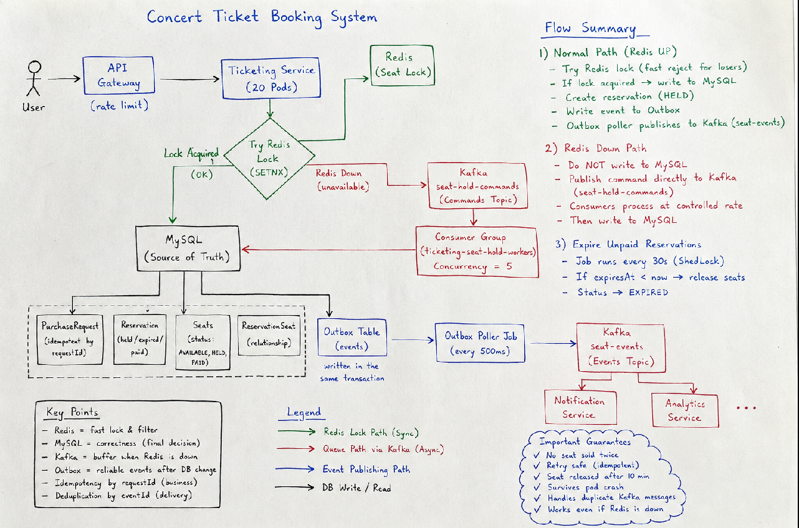
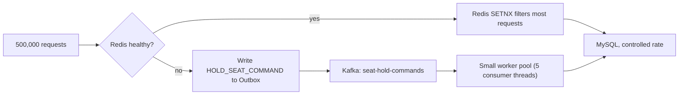

# Concert Ticket Booking System

A backend system for selling concert tickets under heavy, sudden traffic, without selling the same seat twice.

## Table of Contents

1. [Problem Statement](#1-problem-statement)
2. [Architecture](#2-architecture)
3. [Data Model](#3-data-model)
4. [Why This Design](#4-why-this-design)
5. [API Endpoints](#5-api-endpoints)
6. [Running Locally](#6-running-locally)
7. [Possible Future Improvements](#7-possible-future-improvements)

---

## 1. Problem Statement

We have a concert with **10,000 seats**.

Ticket sales start at exactly **10:00 AM**. In the first **30 seconds**, the system receives
**500,000 buy requests**.

The system has these building blocks:
- 20 application Pods (stateless, can restart or crash at any time)
- Redis
- MySQL
- Kafka

The system must guarantee:
- A single seat is **never** sold to two different people.
- A user who clicks "buy" many times, or whose request is retried by the network, does **not**
  buy the same seat twice.
- If a user picks a seat but never pays, the seat is released back to "available" after
  **10 minutes**.
- If a Pod crashes in the middle of a request, no seat is left locked forever.
- If Kafka delivers the same message more than once (which is normal for Kafka), the system
  still behaves correctly.
- If Redis goes down, the system keeps working — just with a clear, understood trade-off.

---

## 2. Architecture



The main idea is simple: **Redis makes the system fast, MySQL keeps the data correct, and Kafka handles work outside the main request.** The system never trusts Redis alone for correctness —
MySQL is always the final judge of what is true.

### 2.1 Normal path (Redis is healthy)


Step by step:

1. **Idempotency check.** Every request carries a `requestId`, generated once on the client
   when the user clicks "buy" and reused on every retry. If we already have a
   `PurchaseRequest` with that id, we return the same result instead of doing the work again.
   This is what stops a user from buying the same seat twice by retrying.

2. **Redis lock (fast layer).** We try `SETNX seat-lock:{seatId}` (set the key only if it does
   not exist) with a 10-minute expiry. This is very fast (Redis is single-threaded and this is
   a simple operation), so it can reject almost all of the losing requests in milliseconds,
   without ever touching MySQL. Out of 500,000 requests for 10,000 seats, only a small fraction
   need to go further.

3. **MySQL lock (source of truth).** Even after Redis says "you have the lock," we still run
   `SELECT ... FOR UPDATE` on the seat row in MySQL and check its status. This is the layer
   that actually decides whether the seat is sold. Redis makes things fast; MySQL makes them
   correct. If Redis ever agreed with two different requests by mistake (bug, network issue,
   partial failure), MySQL still refuses to let both win.

4. **Reservation created.** The seat status becomes `HELD`, a `Reservation` row is created with
   `expiresAt = now + 10 minutes`, and everything is saved in **one database transaction**.

5. **Outbox event written.** In the very same transaction, we write a row to an
   `outbox_events` table describing what happened (`SEAT_HELD`). We do **not** call Kafka
   directly here — see [4.5](#45-why-the-outbox-pattern) for why.

6. **A separate job publishes to Kafka.** A scheduled job (`OutboxPublisherJob`) runs every
   500ms, reads unpublished outbox rows, and sends them to a Kafka topic. Other services
   (email, analytics, finance) consume this topic separately, without slowing down the
   purchase itself.

### 2.2 Releasing unpaid seats (background job)

A scheduled job (`ReservationExpiryService`) runs every 30 seconds. It finds every
`Reservation` still `HELD` whose `expiresAt` is in the past, sets it to `EXPIRED`, and sets the
seat back to `AVAILABLE`. This is the real safety net for the 10-minute rule — it does **not**
depend on Redis. Even if Redis crashed and lost every key, this job still frees the seats,
because the expiry time lives in MySQL, not in a Redis TTL.

Since this job runs on all 20 Pods, we use **ShedLock** (a small library backed by a MySQL
table) so that only one Pod actually executes it at a time. Without this, 20 Pods would try to
release the same expired reservations at the same time.

### 2.3 Surviving a Pod crash

No Pod keeps important state in memory. Every step is written to MySQL immediately, inside a
transaction. So if a Pod crashes half-way through a request:

- If it crashed before the database write, nothing happened — the seat was never touched.
- If it crashed after the database write, the write already exists in MySQL, and Kubernetes
  simply restarts the Pod. The next request (or the expiry job, after 10 minutes) picks up from
  exactly where the database says things are.

A seat can never stay locked "forever," because its fate is always written down in MySQL, not
held only in one Pod's memory.

### 2.4 What happens if Redis goes down

This is the most important failure case, so it has its own section.

**Simple idea (not used):** if Redis is down, just skip it and hit MySQL directly with
`SELECT ... FOR UPDATE`. The problem: MySQL was never designed to handle 500,000 at the same time
write attempts. Without Redis filtering out the losing requests first, this could overwhelm the
database (too many open connections, lock contention, timeouts).

**What we do instead: use Kafka as a queue and control the MySQL load.**



When Redis is unavailable:

1. The request is **not** sent to MySQL directly. Instead, we write a `HOLD_SEAT_COMMAND` row
   to the same outbox table (same transaction as saving the `PurchaseRequest`, so nothing is
   lost even if the Pod crashes right after).
2. The API immediately answers the client with `202 Accepted` instead of `201 Created`, meaning
   "we received your request, check back for the result."
3. The `OutboxPublisherJob` ships that command to a Kafka topic called `seat-hold-commands`.
4. A small, fixed-size pool of consumer threads (currently 5, configurable) reads from that topic and
   performs the actual `SELECT ... FOR UPDATE` work in MySQL — at a rate MySQL can handle, no
   matter how many requests are waiting in Kafka.
5. The client polls `GET /reservations/status/{requestId}` until the result changes from
   `PROCESSING` to `SUCCEEDED` or `FAILED`.

Kafka is a good fit here because it can handle very high write rates (hundreds of thousands of
messages per second) far more easily than a database can handle write transactions.
Using it as a buffer means MySQL only ever sees traffic at the pace we choose, not the pace the
crowd arrives at.

**Correctness is never at risk either way** — the same MySQL `SELECT ... FOR UPDATE` logic
runs whether Redis is up or down. Only the speed and the response type (immediate vs. "check
back later") change.

### 2.5 Handling duplicate Kafka messages

Kafka ensures **at-least-once** delivery, meaning the same message can arrive more than
once. To make this safe, every message carries a unique `eventId`. Before processing a message,
each consumer checks a `processed_events` table:

- If the `eventId` is already there, the message is a duplicate — skip it.
- If not, record it and process the message, in the same database transaction.

This makes processing a message twice have the exact same effect as processing it once
(this property is called **idempotency**).

### 2.6 Clean Architecture layering

The code is organized in layers, so that business rules do not depend on frameworks:

- **`domain`** — plain entities (`Seat`, `Reservation`, `Payment`, ...) and repository
  *interfaces* (ports). This layer does not know about Spring, JPA, Redis, or Kafka.
- **`application`** — the actual business logic (use cases like "hold a seat," "confirm a
  payment"), plus ports for things the business logic needs but doesn't implement itself (like
  `SeatLockPort`, `OutboxEventWriter`).
- **`infrastructure`** — the real implementations: Spring Data JPA repositories, the Redis
  adapter, Kafka producers/consumers. This is the only layer that knows about specific
  technologies.
- **`web`** — REST controllers, request/response mapping, HTTP error handling.

The benefit: if we ever swap MySQL for Postgres, or Redis for something else, only the
`infrastructure` layer changes. The business rules in `application` stay untouched.

---

## 3. Data Model

### 3.1 Entity overview

| Entity | What it represents |
|---|---|
| `User` | A person who logs in with a phone number. |
| `Event` | A concert (name, start time, sale status). |
| `Seat` | One physical seat for one event. Has a status and a version (for optimistic locking). |
| `Reservation` | A temporary or confirmed hold on one or more seats, by one user. |
| `ReservationSeat` | Join row linking a `Reservation` to a `Seat` (a reservation can cover several seats). |
| `PurchaseRequest` | The idempotency record for one "buy" click, identified by a client-generated `requestId`. |
| `PurchaseRequestSeat` | Join row linking a `PurchaseRequest` to the `Seat`s it asked for. |
| `Payment` | A payment attempt against a `Reservation`. |
| `OutboxEvent` | A row waiting to be published to Kafka, written in the same transaction as a business change. |
| `ProcessedEvent` | A record that a given Kafka message (`eventId`) was already handled, used to ignore duplicates. |

### 3.2 Entity details, with examples

**`User`**
A user identifies themselves by phone number only (no password in this design — a real system
would add an SMS/OTP step).

```
User { userId: 1, phoneNumber: "+989121234567" }
```

**`Event`**
One row per concert. `status` controls whether it is currently sellable
(`DRAFT`, `ON_SALE`, `SOLD_OUT`, `FINISHED`, `CANCELLED`).

```
Event { eventId: 5, name: "Summer Night Concert", startsAt: 2026-09-20T20:00, status: ON_SALE }
```

**`Seat`**
One row per physical seat, always tied to one `Event`. `status` is the seat's own truth:
`AVAILABLE`, `HELD`, or `PAID`. The `version` column is used for optimistic locking, as a second
safety net on top of the pessimistic `SELECT ... FOR UPDATE` lock. `activeReservation` points to
whichever `Reservation` currently holds it (null when `AVAILABLE`).

```
Seat { seatId: 4821, event: 5, seatNumber: "R12-7", status: HELD, activeReservation: 900 }
```

**`Reservation`**
Represents one hold, for one user, possibly covering several seats at once (e.g. a group of 4
friends buying 4 seats together in one click). `expiresAt` is the 10-minute deadline. `status`
moves through `HELD -> PAID` (success) or `HELD -> EXPIRED` (timeout) or `-> CANCELLED`.

```
Reservation {
  reservationId: 900, event: 5, user: 1, status: HELD,
  expiresAt: 2026-09-20T10:00:37, seats: [4821, 4822]
}
```

**`ReservationSeat`**
Just a join row (`reservationId` + `seatId`). It exists because one `Reservation` can hold
several seats, and one `Seat` will appear in many `ReservationSeat` rows over time — one per
attempt — which is exactly how we build the **seat history** (see `GET /seats/{id}/history`):
we look up every `ReservationSeat` row for that seat, follow it to its `Reservation`, and list
who held it, when, and what happened.

**`PurchaseRequest`**
The idempotency guard. Its primary key **is** the client-generated `requestId` (not an
auto-increment number), so the database itself refuses to store the same request twice. Its
`status` (`PROCESSING`, `SUCCEEDED`, `FAILED`) also doubles as the answer to
"is my request done yet?" for the Redis-down / async path.

```
PurchaseRequest {
  requestId: "b6e2f6b0-...-a91c", user: 1, event: 5,
  status: SUCCEEDED, reservation: 900
}
```

**`PurchaseRequestSeat`**
Join row linking one `PurchaseRequest` to the seats it originally asked for. Kept separately
from `ReservationSeat` because a purchase request can fail before a `Reservation` even exists —
we still want a record of what the user tried to buy.

**`Payment`**
One row per payment attempt against a `Reservation`. `status` is `PENDING`, `SUCCEEDED`,
`FAILED`, or `REFUNDED`. `providerReference` stores the payment gateway's own transaction id, so
we can look up a charge on their side if needed.

```
Payment { paymentId: 77, reservation: 900, amount: 2, status: SUCCEEDED, providerReference: "pi_123" }
```

**`OutboxEvent`**
Not part of the "business" data model — it is technical support data for reliable messaging. Written in the
same transaction as a business change (see [4.5](#45-why-the-outbox-pattern)), then picked up
and sent to Kafka by a background job, then marked `published = true`.

```
OutboxEvent {
  eventId: "b1a2...", aggregateType: "Reservation", aggregateId: "900",
  eventType: "SEAT_HELD", payload: "{...}", published: false
}
```

**`ProcessedEvent`**
Also technical support data, not business data. Its primary key is the Kafka message's `eventId`. Before a
consumer acts on a message, it checks this table; if the id is already there, it stops.

---

## 4. Why This Design

### 4.1 Why Redis for locking

Redis is extremely fast for simple key operations (over 100,000 ops/sec on a single node is
normal), and `SETNX` (set a key only if it doesn't already exist) is exactly the basic operation a
"first come, first served" lock needs, and it's atomic — no race condition between "check" and
"set." In the first 30 seconds of the sale, most of the 500,000 requests are competing for
seats someone else already grabbed; Redis rejects those in milliseconds, so MySQL only sees the
requests that have a real chance of succeeding.

### 4.2 Why MySQL is still checked after Redis

Because correctness cannot depend on a cache. Redis can restart, lose data, or (in theory) have
a bug. MySQL is the one place we treat as "the truth" — a seat is only ever really sold when a
row in MySQL says so. This is why `SELECT ... FOR UPDATE` still runs even after Redis approves a
request.

### 4.3 Why the idempotency key stops retries

Networks are unreliable — a client might send the same "buy" request twice because the first
response was lost, or because a user impatiently clicks twice. By making the client generate one
`requestId` per click and reusing it on every retry, and by making that id the **primary key**
of `PurchaseRequest`, the database itself ensures the second attempt cannot create a second
row. We just look up the existing result and return it.

### 4.4 Why Kafka

Kafka does two different jobs in this system:

1. **Decoupling side effects.** After a seat is held or a payment succeeds, several unrelated
   systems care (email confirmation, analytics dashboard, finance reporting). Without Kafka,
   the purchase request would have to call all of them directly and wait, making it slower and
   more easy to break (one slow/broken service would block ticket sales). With Kafka, the purchase
   flow just writes one event and moves on; each consumer reads it separately, at its own
   pace.

2. **Load leveling when Redis is down.** As explained in [2.4](#24-what-happens-if-redis-goes-down),
   Kafka can handle far more writes per second than MySQL can. Using it as a buffer protects the
   database from being overwhelmed during the exact moment we already lost our fast filtering
   layer.

### 4.5 Why the Outbox pattern

Without it, we would have to write to MySQL and call Kafka as two separate, unrelated actions.
If the Pod crashes between the two (very possible under this kind of load), we'd end up with a
seat marked `HELD` in the database but no event ever sent — or the opposite. This is called the
**dual-write problem**. The fix: write the "event to send" as a normal row in the same database
transaction as the business change. Either both are saved, or neither is. A separate job then
reads unsent rows and forwards them to Kafka, retrying safely if it fails, since the source row
is still sitting there marked `published = false`.

### 4.6 Why ShedLock

Both background jobs (`ReservationExpiryService` and `OutboxPublisherJob`) run on every Pod. If
we let all 20 Pods run the same scheduled job at the same time, we would waste resources and
risk odd edge cases (two Pods racing to publish the same outbox row). ShedLock is a tiny library
that uses a row in MySQL as a mutex, so only one Pod actually runs the job on each tick; the
other 19 simply skip that run.

### 4.7 What we deliberately did *not* add (yet)

- **Redisson / auto-renewing locks.** Our Redis lock's TTL (10 minutes) already matches the
  business rule (hold expires after 10 minutes), and the hold operation itself takes
  milliseconds, so there's little risk of the lock expiring mid-operation. A tool like Redisson
  (with its "watchdog" that automatically extends a lock while its owner is still alive) would
  be worth adding if we introduced longer-running locked operations.
- **A circuit breaker library (e.g. Resilience4j).** Right now, "Redis down" is detected with a
  simple try/catch around each Redis call. This works, but it means every single request still
  pays the cost of attempting to reach a dead Redis before falling back. A circuit breaker would
  trip after a few failures and skip the attempt entirely for a while, saving latency. Listed
  here as a good next step, not yet implemented.

---

## 5. API Endpoints

| Method | Path | What it does |
|---|---|---|
| `POST` | `/api/auth/login` | Logs in (or registers) a user by phone number. |
| `GET` | `/api/events` | Lists events currently on sale. |
| `GET` | `/api/events/{eventId}` | Gets one event. |
| `GET` | `/api/events/{eventId}/seats` | Lists all seats for an event, with their current status. |
| `POST` | `/api/reservations/hold` | Tries to hold one or more seats. Returns `201` if resolved immediately, `202` if queued (Redis was down). |
| `GET` | `/api/reservations/status/{requestId}` | Polls the result of a hold request. |
| `POST` | `/api/payments/confirm` | Confirms payment for a `HELD` reservation. |
| `GET` | `/api/seats/{seatId}/history` | Full history of who has held a given seat over time. |

---

## 6. Running Locally

You need MySQL, Redis, and Kafka running. The easiest way is Docker:

```bash
docker compose up -d
```

Then run the app:

```bash
mvn spring-boot:run
```

On first startup, `SeatSeeder` automatically creates a sample event and 10,000 `AVAILABLE`
seats, so you can start testing right away (see `src/main/java/.../bootstrap/SeatSeeder.java`).

---

## 7. Possible Future Improvements

- Add a `@Profile("dev")` guard on `SeatSeeder`, so it never accidentally runs in production.
- Add Resilience4j (or similar) as a circuit breaker in front of Redis calls.
- Add rate limiting at the API gateway level, so a single abusive client can't dominate the
  queue.
- Add metrics (Micrometer + Prometheus) for: Redis lock hit/miss rate, outbox publish lag,
  Kafka consumer lag, and MySQL connection pool saturation — these are the numbers that would
  tell us, in real time, whether the system is coping with a traffic spike.
- Add integration tests that simulate concurrent requests for the same seat, to prove the
  double-booking guarantee under real concurrency, not just in theory.
- Add an admin API for creating/managing events and seat maps, instead of relying on the
  startup seeder.
