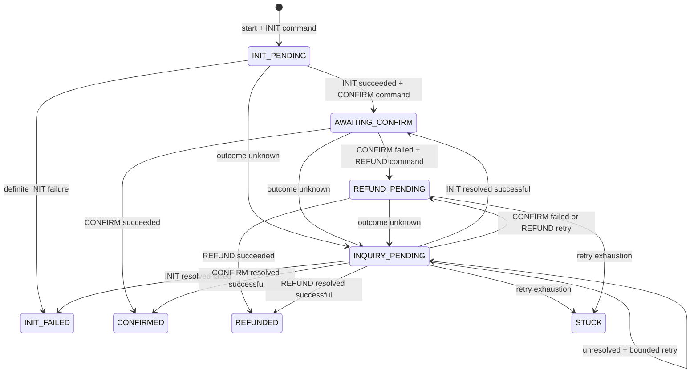

# Payment architecture

`payment_events` is the authoritative payment state. `payments` is a disposable synchronous projection. The payment module lives under `ro.midra.ticketing.payment`; the existing HTTP controller and shared outbox retain their project locations.

## Responsibilities

| Component | Responsibility |
|---|---|
| `PaymentAggregate` / `PaymentEvent` | Pure Java state machine and explicit record events. Commands raise facts; live commands and historical replay share one private `apply` implementation. No public setters, Spring, JPA, clocks, Jackson, or gateways. |
| `StartPaymentHandler` / `StartPaymentTransaction` | Validate ownership, hold status, expiry and demo amount; allocate a new attempt after a definitive failure/refund. |
| `PaymentSaga` | Choose the next durable operation, inquiry, compensation, retry or manual intervention. |
| `PaymentStepTransactions` | Commit a dispatch, result or recovery decision in a short database transaction. |
| `PaymentCommandWorker` | Make exactly one external call between transactions. `Propagation.NEVER` and an explicit transaction assertion protect this boundary. |
| `JpaPaymentEventStore` | Serialize typed facts and append using the caller's expected stream version. |
| `PaymentCommitter` / `PaymentProjector` | Append facts and map their replayed state into the projection atomically. Projection mapping contains no business transition rules. |
| `PaymentQueryService` / `PaymentReplayService` | Efficient status reads, event-only replay, and per-payment projection rebuilding. |
| `ReservationPaymentHandler` | Restore HELD on failure/refund; on success, mark reservation/seats PAID and enqueue notifications/owner-checked Redis lock release. |

`PaymentServiceImpl`, the old `Payment` write entity, JPA `PaymentEvent`, generic application payment payloads and duplicated `PaymentProjectionState.fold` are replaced.

## Workflow and transactions

1. **Start TX:** lock the reservation; validate user/ownership; check the latest payment attempt; return it unless it is `INIT_FAILED` or `REFUNDED`. For a new attempt, validate HELD status and the original expiry; allocate an identity; append `PaymentInitiated` and `PaymentInitRequested`; set reservation `PAYMENT_PENDING`; create `INIT_PAYMENT`; project the facts; commit. No gateway is called. The unchanged `/api/payments/confirm` route returns HTTP **202** with the payment state.
2. **Dispatch TX:** consume a database outbox command; rehydrate the aggregate and validate its request ID/operation; append `PaymentProviderCallStarted`, including a recovery deadline; commit.
3. **Outside TX:** call INIT, CONFIRM, INQUIRY or REFUND once, using `operationId + "-" + targetOperation` as the stable provider idempotency key.
4. **Result TX:** rehydrate, reject obsolete results, append explicit outcome events, and atomically write the next command or terminal integration message plus projection. INIT never calls CONFIRM recursively.
5. **Reservation TX:** a separate message handler locks the reservation. On definitive failure/refund it restores HELD without accessing seat rows, changing the expiry, or writing seat notifications or lock releases. On confirmation it locks the seats, sets seats/reservation PAID, and writes seat notification and lock-release outbox messages. Redis release runs later, outside this TX, using compare-and-delete against the original hold owner.

Each payment attempt has its own permanent identity and event stream. A reservation can cycle through `HELD -> PAYMENT_PENDING -> HELD` after `INIT_FAILED` or `REFUNDED`, with the same seats and original 10-minute deadline. There is no attempt limit; the existing hold validation rejects retries at or after expiry, and the normal expiry job releases expired HELD reservations. CONFIRMED, STUCK and in-flight attempts remain idempotent on repeated starts. STUCK or uncertain payments retain `PAYMENT_PENDING` and held seats because the customer may have been charged.

Gateway waits must not hold database connections or locks, and provider effects cannot roll back with SQL. This is why each side effect is preceded by committed intent and followed by a separate result transaction. Configure a real provider's client timeout below the **60-second dispatch recovery deadline**.

## Outbox, duplicates and crashes

The existing `outbox_events` table carries explicit `INIT_PAYMENT`, `CONFIRM_PAYMENT`, `INQUIRE_PAYMENT`, `REFUND_PAYMENT`, reservation payment integration messages and owner-checked lock releases. Domain events are not automatically published. Internal payment work needs neither Kafka nor in-memory continuation. Existing seat notifications still go to Kafka; the publisher waits for broker acknowledgement before marking a row published.

Publication is at least once. Failed deliveries remain unpublished with a capped backoff in `available_at` and `delivery_attempts`, so one failing row does not repeatedly monopolize the batch. Payment workers validate the aggregate's request ID and dispatched state before I/O; optimistic event append fences simultaneous dispatchers. Stable provider keys protect a second layer of idempotency. Reservation updates lock and inspect the existing terminal state before creating notifications. Redis release retries cannot delete a later buyer's lock.

The existing reservation-state guards are retained for this change. They do not deduplicate failed outcomes per attempt: a duplicate failure while the reservation is HELD throws, and an old failure redelivered during a newer PAYMENT_PENDING attempt can restore HELD again. Handling those redeliveries safely requires a separate check identifying which attempt owns the pending reservation.

If CONFIRM charges the customer and the application dies before its result commits, the stream retains `PaymentConfirmRequested` and `PaymentProviderCallStarted`. Redelivery does not send that dispatched CONFIRM again. Once the persisted deadline is due, recovery records the missing result as unknown, then durably schedules INQUIRY against the **same CONFIRM key**. A successful inquiry raises `PaymentInquiryResolved` and `PaymentConfirmed`. Late results from superseded requests are ignored. A crash between intent and dispatch is also recoverable: the original unpublished outbox command remains eligible for normal delivery.

If INIT succeeds and the application dies immediately after committing the result, its CONFIRM command is already in the outbox and is consumed after restart.

## Retry and compensation

Timeouts, UNKNOWN and gateway transport exceptions are uncertain outcomes. The aggregate retains the original INIT/CONFIRM/REFUND target. Initial inquiry becomes due after 30 seconds. Subsequent unresolved inquiries and unsuccessful refunds have six retries, with backoff `min(600, 30 * 2^retryCount)` seconds. The exact retry count, deadline and reason are in `PaymentRetryScheduled`; replay never recomputes them. A lost inquiry response is itself recovered with the same bounded policy.

A deterministic INIT failure (including the existing `TEMPORARY_FAILURE` demo scenario) remains terminal, preserving that provider scenario's baseline semantics. A failed CONFIRM explicitly schedules REFUND compensation. REFUND_SUCCESS and SUCCESS both resolve a refund, including through inquiry. Exhaustion produces `PaymentMarkedStuck`; uncertain/refund cases clearly state that the customer may have been charged and needs manual inquiry/refund. No automatic seat release occurs in STUCK.

`PaymentRecoveryJob` uses the indexed projection only to locate due IDs. `PaymentStepTransactions.recover` always loads actual event-sourced state before deciding what to do. ShedLock remains on recovery and outbox scanning.

## Concurrency and projection recovery

`payment_streams` contains generated Long payment IDs and a non-unique indexed `reservation_id`, independent of the read model. The latest attempt is the highest payment ID for that reservation. Start transactions take a pessimistic reservation lock before consulting or allocating identities; this lock serializes competing starts without a uniqueness constraint or additional locking. Repeated starts validate ownership before returning the latest **event-derived** state, or allocating a new attempt after a retryable failure. The `payments` projection also allows multiple rows per reservation.

Events use `append(paymentId, expectedVersion, events)`, inserting versions N+1, N+2, etc. `UNIQUE(payment_id, sequence_number)` decides concurrent writes; stale/future versions and competing inserts become `ConcurrentPaymentModificationException`. No event sequence comes from `count + 1`.

Projection writes run in the event/outbox transaction. If any local write fails, the entire step rolls back; previously committed steps remain intact. `payments.version` records stream version, not an independent JPA business version. The projector locks the identity row and refuses to replace a newer projection with an older stream, protecting a rebuild racing normal processing.

- `GET /api/payments/{id}/status`: projection query.
- `GET /api/reservations/{reservationId}/payments`: all attempts in ascending payment ID order, loaded from events and returned in the same response shape as status; an empty history returns `[]`.
- `GET /api/payments/{id}/replay`: rehydrate directly from `payment_events`; no projection read.
- `POST /api/payments/{id}/rebuild`: recreate the projection from the stream, even when absent.
- `PaymentProjectionRebuilder.rebuildAll()`: enumerate IDs from events and rebuild one transaction per payment.
- `--payment.projections.rebuild-on-startup=true`: run the full rebuilder at startup. For an operational full rebuild, also use `--app.scheduling.enabled=false`, then restart with scheduling enabled after verification.

The projection has IDs, amount, status, provider/reference keys, target/requested operations, dispatch state, retry information and timestamps. Deleting it does not delete event history or identity. Recovery scanning needs the projection restored before it can discover missing rows.

## Schema and existing databases

Fresh databases continue to use the project's Hibernate `ddl-auto=update` convention; `schema.sql` still creates ShedLock. JPA maps the new event entity, identity table, disposable view, and outbox delivery columns. There is no new migration framework.

Existing event-sourced databases must stop all application instances, back up, and run [`payment-attempts.sql`](../src/main/resources/db/manual/payment-attempts.sql) before deploying retry support. It adds non-unique reservation indexes and removes single-column reservation uniqueness from both identity and projection tables, including Hibernate-generated constraint names. Hibernate `ddl-auto=update` alone does not remove these existing constraints. Existing CANCELLED reservations remain cancelled; the new behavior applies to outcomes handled after deployment.

Pre-event-sourcing databases must stop all application instances, back up, and run [`payment-event-sourcing-cutover.sql`](../src/main/resources/db/manual/payment-event-sourcing-cutover.sql) **once before deploying**, followed by `payment-attempts.sql` to cover any existing reservation constraints/indexes. Do not use a client's `--force` option. MySQL DDL is not transactional. The cutover script:

- refuses duplicate legacy payment identities per reservation or a repeated/partially started cutover;
- preserves old rows in `payments_legacy` and `payment_events_legacy`;
- retains public Long payment IDs and stable operation keys;
- records `PaymentInitiated` plus an explicit `PaymentLegacyStateImported` checkpoint;
- sends active legacy operations to inquiry because old attempt/result persistence was unsafe;
- adds payment identities, projection workflow columns and outbox delivery fields;
- clears only the now-disposable `payments` projection, which must be rebuilt at controlled startup.

The old audit log did not store enough information for exact reconstruction (notably retry timestamps and some inquiry provider references). The cutover checkpoint is an honest import of that legacy state; it does not claim missing historical facts can be recovered. All post-cutover commands are event sourced. Startup refuses an unmigrated legacy event stream.

## Tests and limits

Run `mvn test` with Java 21. Unit tests cover transitions, invalid commands, explicit replay, deterministic retry state and outbox broker acknowledgement. Spring/JPA tests use H2 in MySQL mode with real transaction proxies and no external services. They cover complete flow and deterministic failures, every timeout target, inquiry/refund compensation, duplicate/concurrent starts, competing event appends, transaction rollback, duplicate deliveries, event-only replay, deleted/stale projections, transaction-free gateway calls and the charged-before-result crash scenario.

The amount remains a documented demo calculation: one monetary unit per seat, isolated in `PaymentAmountCalculator`. `DeterministicPaymentGateway` remains an **in-memory provider simulator**; its own ledger resets with its process. Crash tests keep the simulated provider alive while losing/recreating the payment worker, as a separate real provider would remain alive. A production adapter must provide durable provider idempotency and inquiry and enforce network timeouts. Supported hints include the original scenarios plus `INIT_TIMEOUT_THEN_SUCCESS`, `CONFIRM_TIMEOUT_THEN_SUCCESS`, `CONFIRM_TIMEOUT_THEN_FAILURE` and `REFUND_TIMEOUT_THEN_SUCCESS`.

Remaining operational work: implement a real provider adapter and manual intervention tooling for STUCK, reconcile any pre-existing duplicate legacy identities before migration, and validate the cutover on a backup of the deployment's exact MySQL version. Unpublished poison outbox rows retry with backoff and logging; there is no dead-letter administration UI. This project keeps its existing development schema-management approach rather than adding production migration automation.
